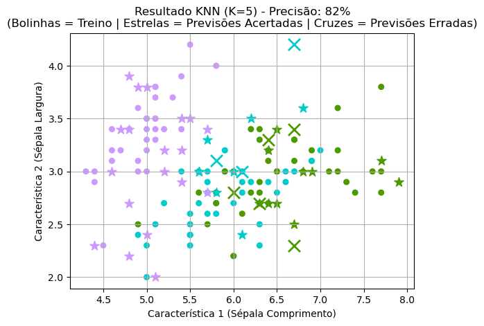

# Trabalho_Programming_Rennan_Sergio

# K-Nearest Neighbors (KNN)

Implementação do algoritmo **K-Nearest Neighbors (KNN)** em Python, desenvolvida sem recurso a funções de bibliotecas para classificação prontas.

Este projeto foi desenvolvido no contexto da unidade curricular **Programação – Data Science & Business Intelligence** no ISAG.

--

## Descrição

O KNN é um algoritmo de classificação supervisionada que atribui uma classe a uma nova observação com base na maioria dos votos dos seus **K vizinhos mais próximos**, utilizando a Distância Euclidiana.

**Objetivos do projeto:**
- Demonstrar a lógica matemática por trás do algoritmo.
- Implementar funções manuais para cálculo de distância e normalização.
- Permitir que o utilizador indique o número K de vizinhos desejado e se a normalização dos dados é necessária.
- Criar visualizações claras, com exemplo de utilização.

-- 

## Funcionalidades Implementadas

O código foi estruturado de forma modular:

1.  **`distance(p1, p2)`**: Cálculo manual da distância Euclidiana.
2.  **`standardize_data(X_train, X_test)`**: Normalização dos dados via **Z-Score** (Média 0, Desvio 1), prevenindo que variáveis com escalas maiores dominem o resultado.
3.  **`KNN(...)`**: O motor de classificação com sistema de votação manual.
4.  **`train_test_split(...)`**: Divisão aleatória dos dados mantendo a reprodutibilidade (`random_seed`).

--

## Exemplo de Aplicação (Dataset Iris)

Para este exemplo, utilizámos apenas as duas primeiras características (Sépala) para permitir uma visualização clara em 2D.

- **Bolinhas:** representam os dados de treino
- **Estrelas:** representam os dados de teste previstos corretamente
- **"X":** representam os dados de teste previstos incorretamente

